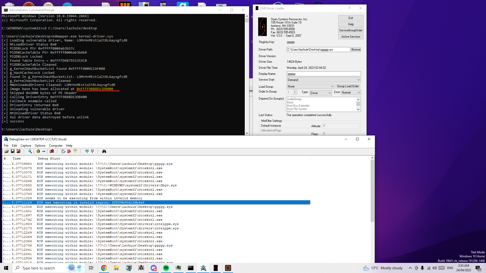

# NMI Callback Handler

simple project to demonstrate how NMIs can be used to stackwalk. will probs expand to include other detection vectors like start address etc.

Example above shows a kernal driver that reads/writes directly to physical memory of a game communicating with a usermode app over ioctl, mapped with the default kdmapper, being found via the stackwalk.